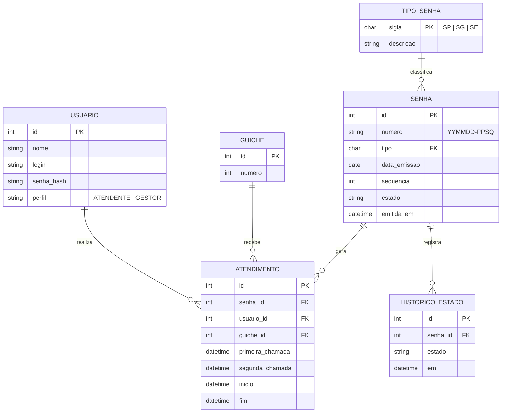

# Modelo Entidade-Relacionamento (MER)

```mermaid
erDiagram
    USUARIO ||--o{ ATENDIMENTO : realiza
    GUICHE ||--o{ ATENDIMENTO : recebe
    SENHA ||--o{ ATENDIMENTO : "gera"
    TIPO_SENHA ||--o{ SENHA : classifica
    SENHA ||--o{ HISTORICO_ESTADO : registra

    USUARIO {
        int id PK
        string nome
        string login
        string senha_hash
        string perfil "ATENDENTE | GESTOR"
    }
    GUICHE {
        int id PK
        int numero
    }
    TIPO_SENHA {
        char sigla PK "SP | SG | SE"
        string descricao
    }
    SENHA {
        int id PK
        string numero "YYMMDD-PPSQ"
        char tipo FK
        date data_emissao
        int sequencia
        string estado
        datetime emitida_em
    }
    ATENDIMENTO {
        int id PK
        int senha_id FK
        int usuario_id FK
        int guiche_id FK
        datetime primeira_chamada
        datetime segunda_chamada
        datetime inicio
        datetime fim
    }
    HISTORICO_ESTADO {
        int id PK
        int senha_id FK
        string estado
        datetime em
    }
```
