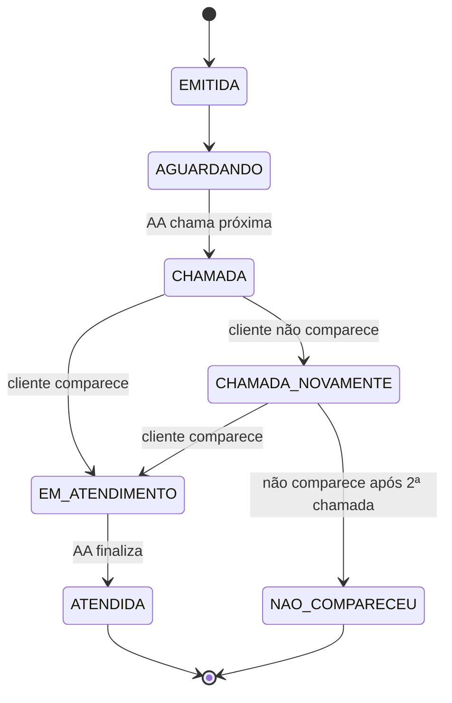

# Máquina de estados da senha

```mermaid
stateDiagram-v2
    [*] --> EMITIDA
    EMITIDA --> AGUARDANDO
    AGUARDANDO --> CHAMADA : AA chama próxima
    CHAMADA --> EM_ATENDIMENTO : cliente comparece
    CHAMADA --> CHAMADA_NOVAMENTE : cliente não comparece
    CHAMADA_NOVAMENTE --> EM_ATENDIMENTO : cliente comparece
    CHAMADA_NOVAMENTE --> NAO_COMPARECEU : não comparece após 2ª chamada
    EM_ATENDIMENTO --> ATENDIDA : AA finaliza
    ATENDIDA --> [*]
    NAO_COMPARECEU --> [*]
```
