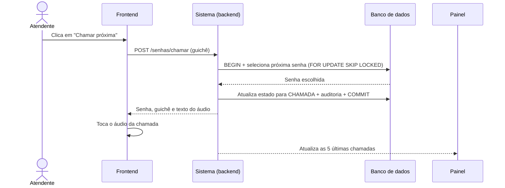

# Sequência: chamar próxima senha

```mermaid
sequenceDiagram
    actor AA as Atendente
    participant FE as Frontend
    participant AS as Sistema (backend)
    participant DB as Banco de dados
    participant PN as Painel

    AA->>FE: Clica em "Chamar próxima"
    FE->>AS: POST /senhas/chamar (guichê)
    AS->>DB: BEGIN + seleciona próxima senha (FOR UPDATE SKIP LOCKED)
    DB-->>AS: Senha escolhida
    AS->>DB: Atualiza estado para CHAMADA + auditoria + COMMIT
    AS-->>FE: Senha, guichê e texto do áudio
    FE->>FE: Toca o áudio da chamada
    AS-->>PN: Atualiza as 5 últimas chamadas
```
